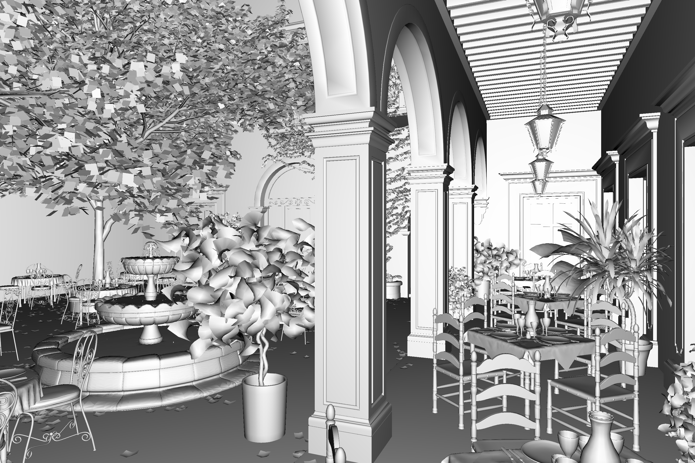

# ray-tracer

A basic ray-tracer in C that implements BVHs and SBVHs, using a fully parallelized approach.  
It doesn't support reflections, materials or even textures however. Triangles are rendered in greyscale using smooth shading.

The parser only supports wavefront (`.obj`) triangulated meshes. It might not support all variants of this format though. If your mesh does not render correctly, try importing it to Blender and exporting it again.

# Basic usage
The first command line argument expects the path to `.obj` file. From then, the program works like a CLI. There are two commands:
* `render [args]` is used to generate an image of the scene (in `output.ppm`). Arguments:
  * `bvh` enables the use of a BVH to speed up the rendering process (will error if the `bvh` command wasn't used beforehand).
  * `heatmap` generates a heatmap in addition to the render (in `heatmap.ppm`).
  * `red=n` (where `n` is an integer) sets the hit threshold beyond which pixels get bright red on the heatmap.
  * Any other argument will be interpreted as the path to a render configuration file.
* `bvh [args]` is used to generate a BVH for the scene. It is then saved for all future renders. Arguments:
  * `spatial` enables the use of spatial splits.
  * `output` creates a mesh of the BVH (in `bvh.obj`).
  * `alpha=f` (where `f` is a float between `0` and `1`) sets the alpha parameter for spatial splits.

# Example config file
The camera position is defined using spherical coordinates, whose center is `FOCUS`. Angles are expected in `degrees`.
```
RATIO: 3/2
IM_H: 400
VP_H: 1
FOC_L: 1
FOCUS: 0.5 0.5 0.5
R: 3
THETA: 90
PHI: -90
```
